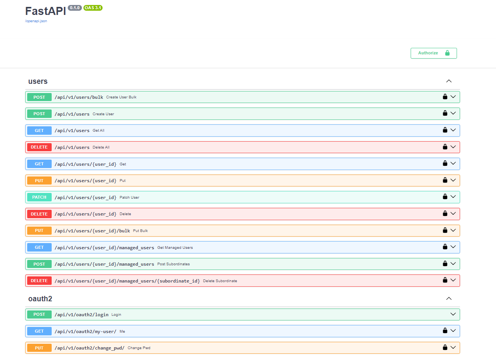
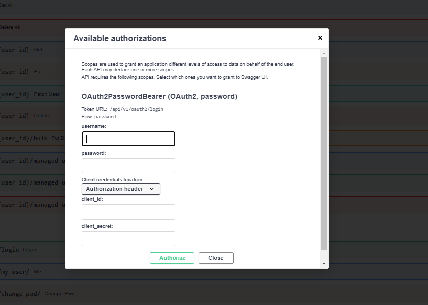

# User Management RESTful API with FastAPI, Redis and JWT

## Table of Contents

- [Introduction](#introduction)
  - [Features](#features)
  - [Author](#author)
- [Prerequisites](#prerequisites)
  - [Docker Compose (Linux)](#docker-compose-linux)
  - [Python 3.8](#python-38)
- [How to Launch](#how-to-launch)
  - [First launch](#first-launch)
  - [Standard setup](#standard-setup)
- [Usage](#usage)
- [Improvement Proposal](#improvement-proposal)

## Introduction



This is a secure and efficient REST API for user administration. From creating new users to managing subordinates of a manager, this API provides a comprehensive solution. It is designed to ensure the integrity and security of the data with an educational purpose in mind.

This API has JWT (Json Web Token) protection, so only a user registered in the application can perform operations on it.

As a database, a lightweight option such as Redis has been chosen, which is often used as a cache instead of a database. The reason for using it is that since it is a 'simple' and educational application a non-relational option was the best. Among the candidates Redis seemed to me the easiest option to implement.

On the other hand, the language used was Python and FastAPI was chosen as the development framework, due to the similarities it shares with other frameworks when developing APIs such as Springboot (for endpoint implementation).

To be able to use all the functions provided by this API you will have to authenticate yourself, for this a user with admin role has been added by default in the database.

### Features

- User registration and management.
- Role-based access control.
- JSON Web Token (JWT) protection for secure authentication.
- Data storage using Redis, a fast and lightweight option suitable for caching.

### Author

- **Author:** [Pablo Galán Acedo](https://github.com/pgalandev)
- **LinkedIn:** [Pablo Galán Acedo - LinkedIn](https://www.linkedin.com/in/pablo-gal%C3%A1n-acedo-64b400238/)
- **GitHub:** [GitHub Repository](https://github.com/pgalandev/user-management-api-fast-secure-redis)

## Prerequisites

Before you can run this project, make sure you have the following prerequisites installed on your system:

- [Docker](https://docs.docker.com/engine/install/)
- `make` (Linux command)
- Python 3.8

### Python 3.8

Make sure you have Python 3.8 installed on your system. You can download it from the [official Python website](https://www.python.org/downloads/release/python-380/)

## How to launch

To set up and run this project, follow these steps:

### First launch

* Clone the repository
```bash
git clone link_to_github_repository
cd user-management-api-fast-secure-redis
```
* Run the setup command using `make`:
```bash
make default-setup
```

### Standard setup
Once you have made the first launch and **there is a container** for the database, 
you will only have to launch the following `make` each time you want to activate the service and preserve the data on your database:
```bash
make setup
```


## Usage

Once the API is up and running, you can access it using the provided Swagger interface. Visit the [Swagger API documentation](http://localhost:8000/docs#/) (`http://localhost:8000/docs#/`) page to explore and interact with the endpoints.
Then to access to all the functionality you must log in with the mentionated default user:

* **username**: `404bdab1-3dd5-4173-9713-43ec7858b0b5`
* **password**: `test`



## Improvement proposal

* Atomize the user types, having classes for each type, user, manager and administrator. Eliminating the roles field.
* Creating integration tests
